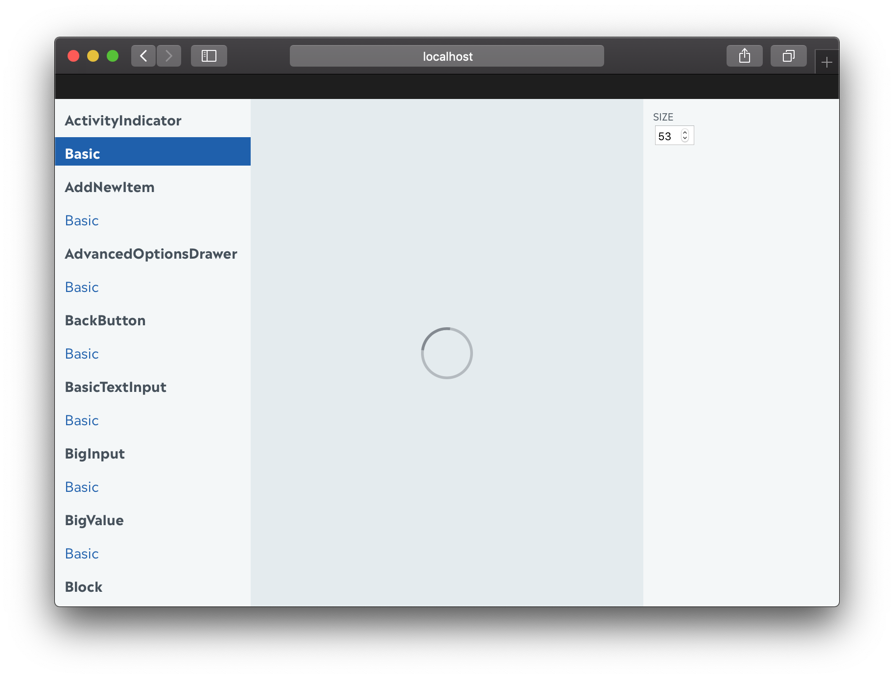

# Reshowcase

> A tool to create demos for your ReasonReact components



```reason
/* path/to/Demo.re */
open Reshowcase.Entry;

demo("Title", ({add}) => {
  add("normal", () =>
    stringProp("text", "hello", text => [<h1> text->React.string </h1>])
  );
  add("font-size", () =>
    intProp("font size", 2, size =>
      stringProp("text", "hello", text =>
        [
          <h1
            style={ReactDOMRe.Style.make(
              ~fontSize=size->Belt.Int.toString,
              (),
            )}>
            text->React.string
          </h1>,
        ]
      )
    )
  );
});

demo("Button", ({add}) =>
  add("normal", () =>
    boolProp("disabled", false, disabled =>
      stringProp("text", "hello", text =>
        [<button disabled> text->React.string </button>]
      )
    )
  )
);

let dateProp =
  withControl((_date, setState) =>
    <button onClick={_event => setState(Js.Date.make())}>
      "Set to now"->React.string
    </button>
  );
demo("CustomProps", ({add}) =>
  add("now", () =>
    dateProp("date", Js.Date.make(), date =>
      [<h1> {date->Js.Date.toUTCString->React.string} </h1>]
    )
  )
);

start();
```

## Install

```console
yarn add --dev reshowcase
```

Then add to your `"reshowcase"` to `bs-dependencies` in your `bsconfig.json`.

> If you're still using JSX 2, install `reshowcase@1.4.0`.

## Usage

```console
$ reshowcase path/to/Demo.bs.js
```

If you need custom webpack options, create the `.reshowcase/config.js` and export the webpack config, plugins and modules will be merged.

If you need a custom template, pass `--template=./path/to/template.html`.
