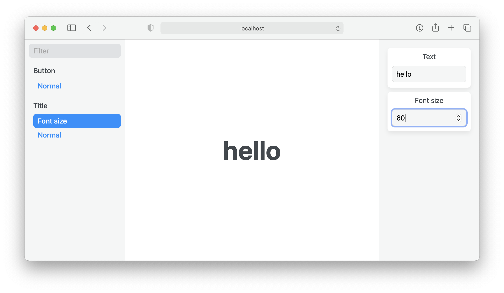

# Reshowcase

⚠️ this is a fork of [original tool](https://github.com/bloodyowl/reshowcase) with the following updates:
- Migrated to use Melange and Dune, instead of ReScript and Ninja
- Use `reason-react` instead of `rescript-react`
- Use Reason syntax instead of ReScript syntax

> A tool to create demos for your Reason React components



```reason
open Reshowcase.Entry;

/* Create a demo*/
demo(({addDemo: _, addCategory}) => {
  /* Add a category */
  addCategory("Title", ({addDemo, addCategory: _}) => {
    /* Add an example*/
    addDemo("normal", ({string, _})
      /* Register "handles" from your JSX directly*/
      => <h1> {string("text", "hello")->React.string} </h1>);
    addDemo("font-size", ({string, int, _}) =>
      <h1
        style={ReactDOM.Style.make(
          /* Handles can be strings, ints, floats and booleans*/
          ~fontSize=
            {let size =
               int("font size", {min: 0, max: 100, initial: 30, step: 1});
             size->Belt.Int.toString ++ {js|px|js}},
          (),
        )}>
        {string("text", "hello")->React.string}
      </h1>
    );
  });
  /* Add another category */
  addCategory("Button", ({addDemo, addCategory: _}) =>
    addDemo("normal", ({string, bool, _}) =>
      <button disabled={bool("disabled", false)}>
        {string("text", "hello")->React.string}
      </button>
    )
  );
});

start();
```

## Install

Install [opam](https://opam.ocaml.org/) package manager.

Then:

```
opam pin add reshowcase.dev git+https://github.com/ahrefs/reshowcase.git#main
```

This will make the NodeJS script `reshowcase` available in your opam switch.

To make sure this script works, add the following dependencies to your application `package.json`:

```json
  "devDependencies": {
    "copy-webpack-plugin": "^11.0.0",
    "html-webpack-plugin": "^5.5.0",
    "webpack": "^5.76.1",
    "webpack-dev-server": "^4.11.1",
  }
```

## Usage

### To start / develop:

```console
$ reshowcase start --entry=path/to/Demo.js
```

### To build bundle:

```console
$ reshowcase build --entry=path/to/Demo.js --output=path/to/bundle
```

If you need custom webpack options, create the `.reshowcase/config.js` and export the webpack config, plugins and modules will be merged.

If you need a custom template, pass `--template=./path/to/template.html`.
